# Dojo — Self Intro

<p align="center">
  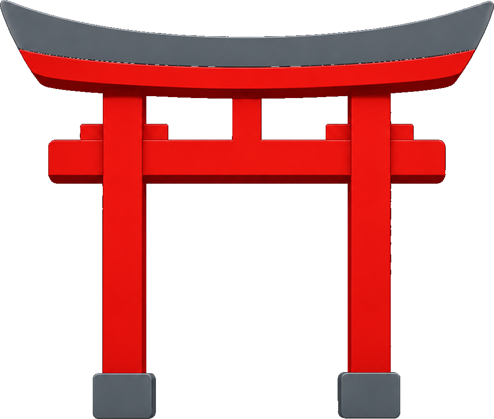
</p>

<p align="center">
  <strong>Dojo creates its own intro video.</strong><br/>
  A capability reel built <em>inside</em> Dojo — talk, listen, Lane Assist, try-on, architecture,<br/>
  product shots, promo, lip-sync, multilingual, diagrams, kids tutor, and the finale.
</p>

<p align="center">
  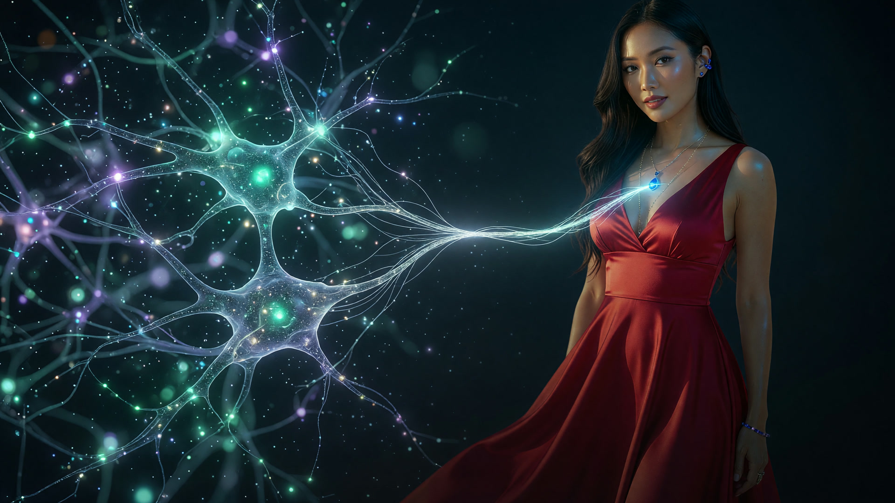
</p>

---

## Watch the reel

| | |
|---|---|
| **Master** | [`public/sections/15.00.00-final/video/final/DOJO-REEL-MASTER.mp4`](public/sections/15.00.00-final/video/final/DOJO-REEL-MASTER.mp4) |
| Runtime | **5:18** · 1920×1080 · H.264 · AAC |
| Loudness | **−14 LUFS** (YouTube) · single-pass encode (crf 16) |
| Built with | [Dojo](https://DojoWorkspace.io) · Remotion · FFmpeg |

> This repo uses **Git LFS** for video/audio. Clone normally, then pull LFS objects:
>
> ```bash
> git lfs install
> git clone git@github.com:neekware/dojo-self-intro.git
> cd dojo-self-intro
> git lfs pull
> ```

Open the master in any player, or drop it into Preview inside Dojo.

---

## Highlights

<p align="center">
  
</p>

| Chapter | Still |
|--------:|:------|
| Talk | 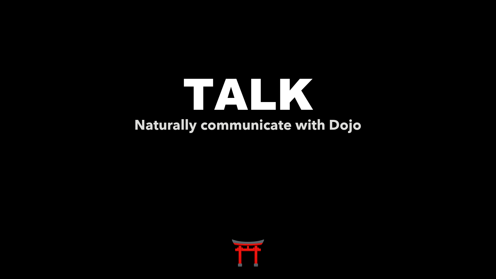 |
| Listen | 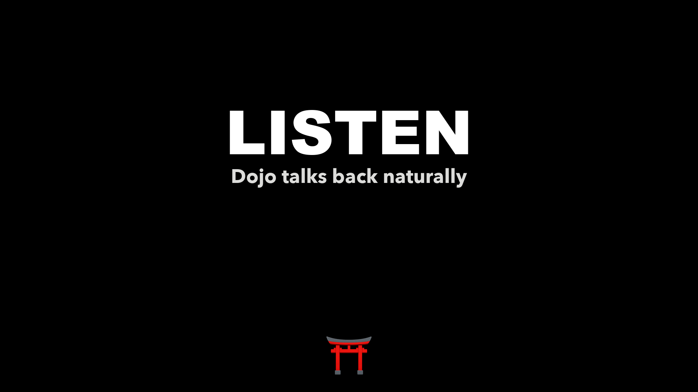 |
| Lane Assist | 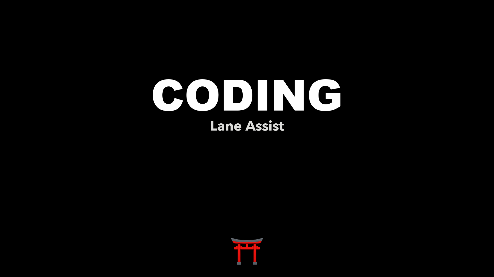 |
| Multimedia | 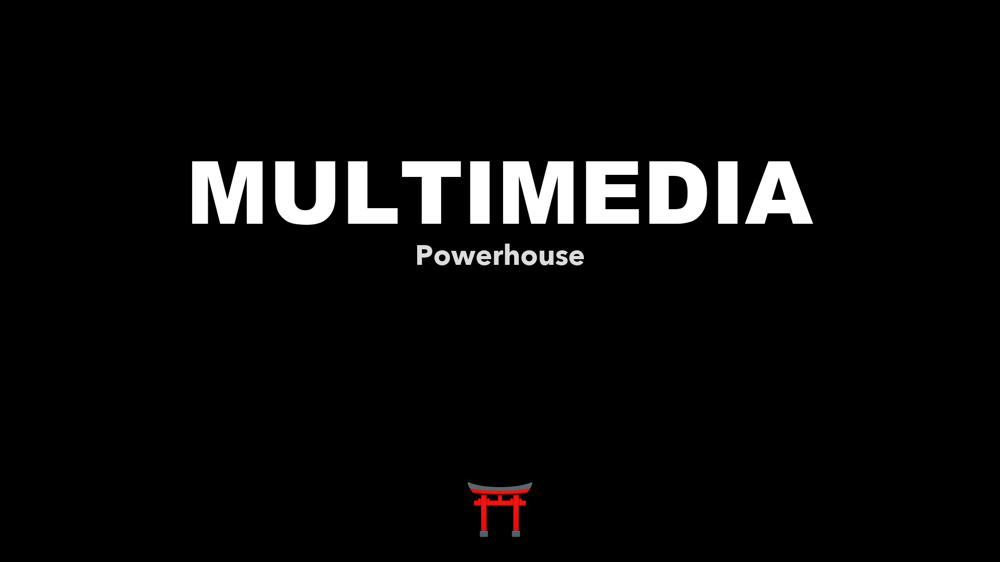 |
| Fashion try-on | 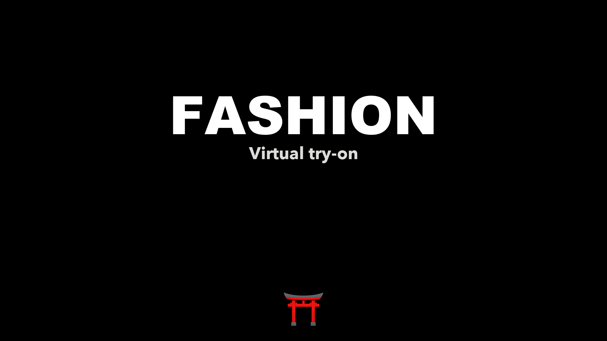 |
| Architecture | 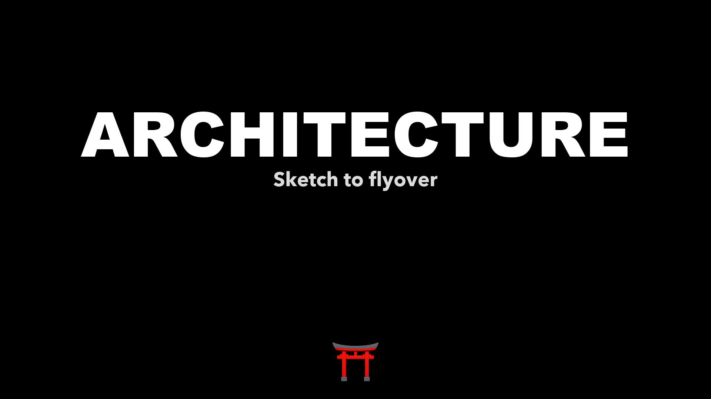 |
| Product combine | 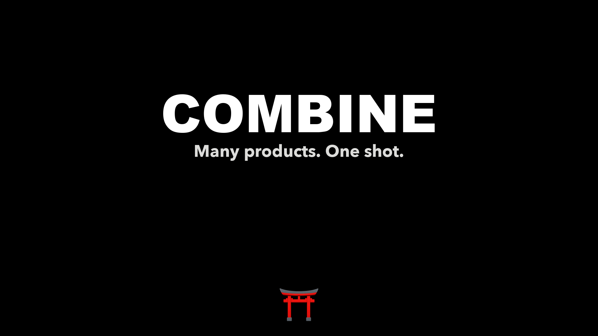 |
| Teach safely | 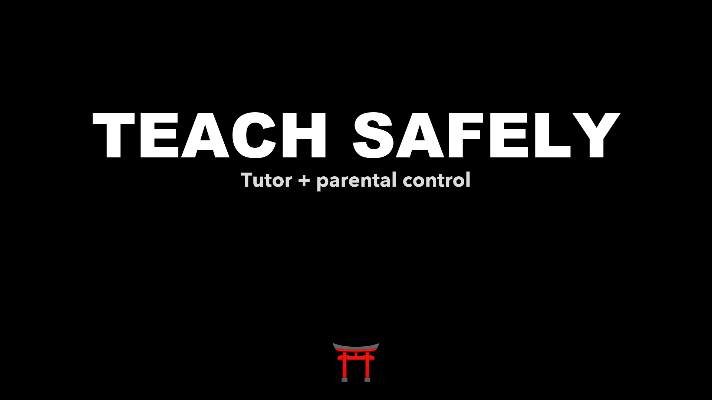 |
| Meet the future | 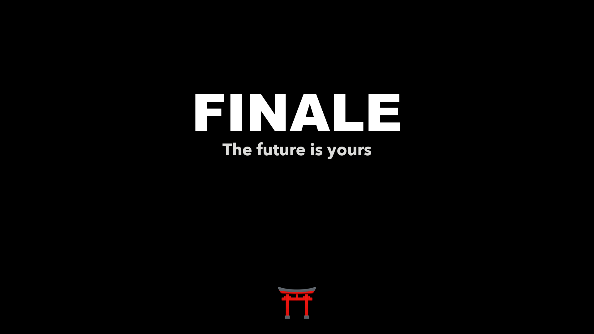 |

---

## Film order

Locked standalones live under each section’s `video/final/`. The master is assembled **once** from those files (no intermediate cumulative re-encodes).

| # | Section | Locked master |
|--:|---------|---------------|
| 00 | Brand open | `00.00.00-brand/video/final/LOCKED-00-brand-open.mp4` |
| 01 | What is Dojo | `01.00.00-what-is-dojo/video/final/LOCKED-01-what-is-dojo.mp4` |
| 02 | Talk (STT) | `02.00.00-stt-talk/video/final/LOCKED-02-stt.mp4` |
| 02.10 | Listen (TTS + eyes + ears) | `02.10.00-tts-listen/video/final/LOCKED-03-*.mp4` |
| 02.20 | Lane Assist | `02.20.00-lane-assist/video/final/LOCKED-lane-assist.mp4` |
| 02.30 | More than coding | `02.30.00-more-than-coding/video/final/LOCKED-02.30-more-than-coding.mp4` |
| 03 | Fashion try-on | `03.00.00-tryon/video/final/LOCKED-03-tryon.mp4` |
| 04 | Architecture HQ | `04.00.00-architecture-hq/video/final/LOCKED-04-architecture.mp4` |
| 05–07 | Dojo X products | combine · coffee · perfume |
| 09 | Promo motion | `09.00.00-promo-motion/video/final/LOCKED-09-promo.mp4` |
| 09.10 | Lip-sync UGC | `09.10.00-lipsync/video/final/LOCKED-09.10-lipsync.mp4` |
| 12 | Characters | `12.00.00-character-life/video/final/LOCKED-12-characters.mp4` |
| 13 | Multilingual | `13.00.00-multilingual/video/final/LOCKED-13-multilingual.mp4` |
| 13.10 | Diagrams & equations | `13.10.00-diagrams-equations/video/final/LOCKED-13.10-diagrams-equations.mp4` |
| 14 | Kids tutor | `14.00.00-kids-tutor/video/final/LOCKED-14-kids-tutor.mp4` |
| 15 | Finale | `15.00.00-final/video/final/LOCKED-15-final.mp4` |

Full tree rules: [`public/sections/README.md`](public/sections/README.md).

---

## Quick start

### 1. Prerequisites

- **Node.js 20+** and **pnpm** (`corepack enable && corepack prepare pnpm@latest --activate`)
- **Git LFS** (`brew install git-lfs` · `git lfs install`)
- **FFmpeg** on `PATH` (for the master assembler scripts)
- Optional: [Dojo](https://DojoWorkspace.io) for the media production workflow that built these clips

### 2. Install

```bash
git lfs install
git clone git@github.com:neekware/dojo-self-intro.git
cd dojo-self-intro
git lfs pull
pnpm install
```

### 3. Studio / Remotion preview

```bash
pnpm dev      # Remotion Studio
pnpm render  # out/dojo-power-showcase.mp4  (composition render)
```

### 4. Rebuild the ship master (single pass + loudnorm)

```bash
# A/V drift check across locked standalones
python3 scripts/check-av-sync.py

# One encode: join every LOCKED section + title cards, loudnorm −14 LUFS
python3 scripts/build-master-reel.py

# Output
#   public/sections/15.00.00-final/video/final/DOJO-REEL-MASTER.mp4
```

### 5. Layout

| Path | What |
|------|------|
| `src/` | Remotion compositions |
| `public/sections/` | Canonical media by capability (`MAJOR.MINOR.PATCH-slug`) |
| `public/sections/*/video/final/` | **Locked standalones** only |
| `public/sections/*/after/final/` | Locked stills + title cards |
| `scripts/` | Master assembler, A/V checks, section builders |
| `docs/` | Script / notes |
| `out/` | Local Remotion renders (gitignored) |

Each section folder:

```text
MAJOR.MINOR.PATCH-slug/
  before/   after/   video/   audio/   text/
  **/final/          ← deliverables only
```

---

## How the master is built

1. Every chapter is approved as a **standalone** `LOCKED-*.mp4`.
2. Intermediate “cumulative” tips are **not** kept — they re-encoded the timeline dozens of times and destroyed early quality.
3. `scripts/build-master-reel.py` loads every standalone + title card into **one** filtergraph:
   - 300 ms incoming dissolve between sections  
   - video/audio drift padding when streams disagree  
   - **loudnorm** `I=-14:TP=-1.0:LRA=11` in the **same** pass  
   - `libx264` crf **16**, AAC 256k, `+faststart`
4. Result: one high-quality master, not a 25th generation copy.

```bash
python3 scripts/build-master-reel.py
```

---

## Brand lockup

- Icon: **torii** line mark only (no griffin on products)
- Wordmark: **Dojo** + cursive **X** → `Dojo X`
- Splash / open stills under `00.00.00-brand/after/final/`

<p align="center">
  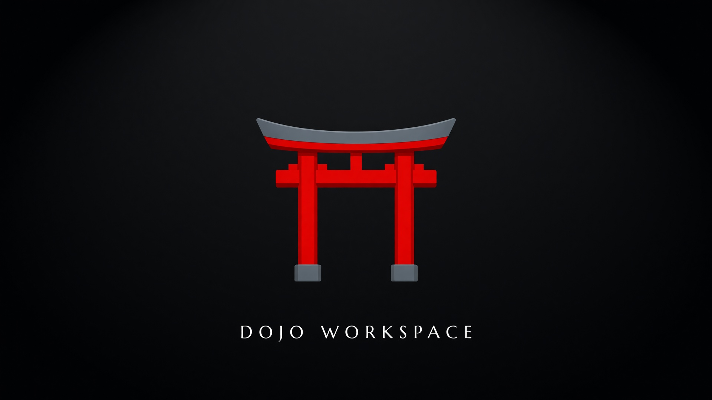
</p>

---

## Git LFS

Large binaries are tracked with Git LFS (see [`.gitattributes`](.gitattributes)):

- `*.mp4` `*.mp3` `*.mov` `*.wav` `*.webm` `*.mkv` `*.m4a` …
- Design sources: `*.psd` `*.tif`

After clone, always:

```bash
git lfs pull
```

If a video opens as a few-hundred-byte text pointer, LFS did not fetch — run the command above.

---

## Blog

A long-form write-up of how Dojo produced this reel is planned separately. This repo is the **media + build** source of truth.

---

## License

`UNLICENSED` / private source. Media and brand marks © Neekware / Dojo.  
Built with ⛩️ [Dojo](https://DojoWorkspace.io).
